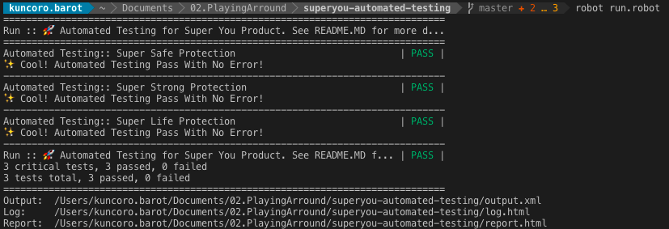

<p align="center">
  <br/>
  <span><b>Superyou</b>: <span>Automated Testing [BETA]</span></a>
</p>
  
<br/>

## Installation

```
pip install robotframework
pip install robotframework-selenium2library
```

## Driver Need to be Installed
### `Macbook`
For running in chrome, you need to install chromedriver:
```
brew cask install chromedriver
```
For running in firefox, you need to install geckodriver:
```
brew cask install geckodriver
```
For running in edge, you need to install edge driver: https://developer.microsoft.com/en-us/microsoft-edge/tools/webdriver/

### `Windows`
For running in chrome, you need to install chromedriver: https://chromedriver.chromium.org/downloads <br/>
For running in firefox, you need to install geckodriver: https://github.com/mozilla/geckodriver/releases <br/>
For running in edge, you need to install edge driver in `command prompt (windows)`:
```
DISM.exe /Online /Add-Capability /CapabilityName:Microsoft.WebDriver~~~~0.0.1.0
```
<br/>

## Configuration

You need to update some variable inside of `config.robot`. 
More description, please find detail at <a href="#more-configuration">More Configuration Section</a>
<br/>

## Run Your Automation

```
robot run.robot
```
<br/>
### Open The Report
```
sh report.sh
```
### Open Detail Log
```
sh report.sh
```

<br/><br/><hr/>
## More Configuration
Here the list and detail of your `config.robot` :
```
.
├── ${BROWSER}
│   :: Which browser do you want to run the testing ?
│   └── chrome
│   └── firefox
│
├── ${CLOSE_BROWSER}
│   :: Do you want close the browser after testcase success ?
│   └── 0 ──: leave browser open after testcase success;
│   └── 1 ──: close browser after testcase success;
│
├── ${SUPERLINK}
│   :: Please provide domain link that will be running for automated testing
│
├── ${SUPERSAFE}
│   :: Do you want to running Super Safe Product ?
│   └── 0 ──: not include SUPERSAFE in product test;
│   └── 1 ──: include SUPERSAFE product test;
│
├── ${SUPERSTRONG}
│   :: Do you want to running Super Strong Product ?
│   └── 0 ──: not include SUPERSTRONG in product test;
│   └── 1 ──: include SUPERSTRONG product test;
│
├── ${SUPERLIFE}
│   :: Do you want to running Super Life Product ?
│   └── 0 ──: not include SUPERLIFE in product test;
│   └── 1 ──: include SUPERLIFE product test;
│
├── ${PH_EMAIL}
│   :: Please provide Policy Holder Email
│
├── ${PH_NAME}
│   :: Please provide Policy Holder Name
│
├── ${PH_MOBILE}
│   :: Please provide Policy Holder Mobile Number
│
├── ${PH_IDENTITY}
│   :: Please provide Policy Holder Identity
│
├── ${PH_GENDER}
│   :: Please provide Policy Holder Gender
│   └── 1 ──: male 
│   └── 2 ──: female
│
├── ${PH_IDENTITY}
│   :: Please provide Policy Holder Identity Number
│
├── ${PH_ADDRESS}
│   :: Please provide Policy Holder Address
│
├── ${PH_BIRTH_AT}
│   :: Please provide Policy Holder Place of Birth
│
├── ${INSURED_RELATION}
│   :: What is insured relation from you ?
│   └── 1 ──: Self
│   └── 2 ──: Wife/Husband
│   └── 3 ──: Son
│   └── 4 ──: Daughter
│   └── 5 ──: Father
│   └── 6 ──: Mother
│   └── 7 ──: Brother
│   └── 8 ──: Sister
│
├── ${INSURED_NAME}
│   :: Please provide Insured Name
│
├── ${INSURED_IDENTITY}
│   :: Please provide Insured Identity Number
│
├── ${BENEFICIARY_RELATION}
│   :: What is beneficiary relation from insured ?
│   └── 1 ──: Self
│   └── 2 ──: Wife/Husband
│   └── 3 ──: Son
│   └── 4 ──: Daughter
│   └── 5 ──: Father
│   └── 6 ──: Mother
│   └── 7 ──: Brother
│   └── 8 ──: Sister
│
├── ${BENEFICIARY_NAME}
│   :: Please provide Beneficiary Name
│
└── ${BENEFICIARY_IDENTITY}
    :: Please provide Beneficiary Identity Number
```

